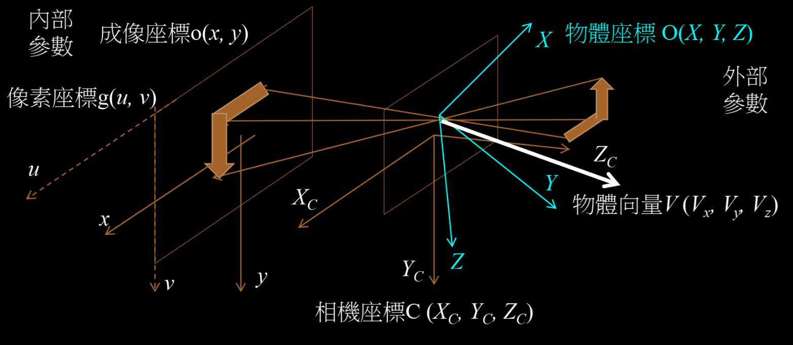
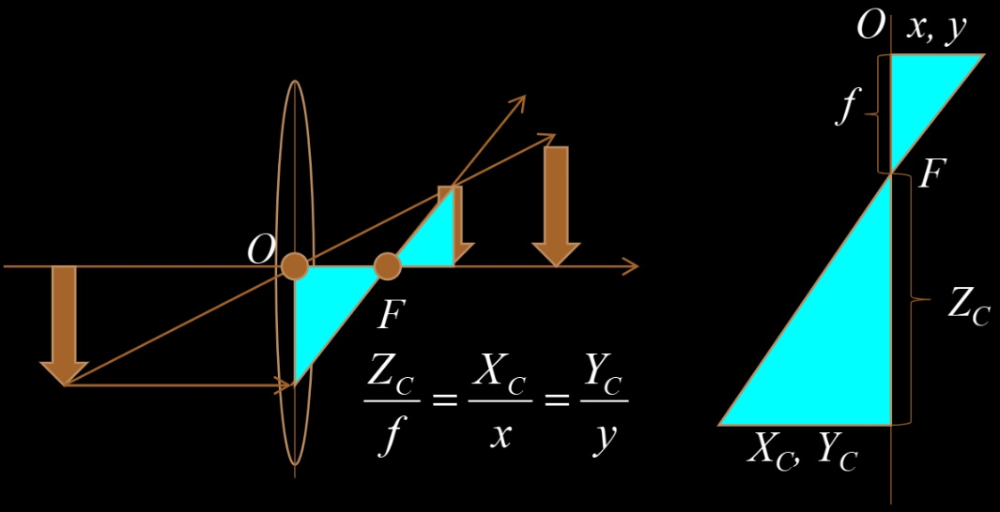
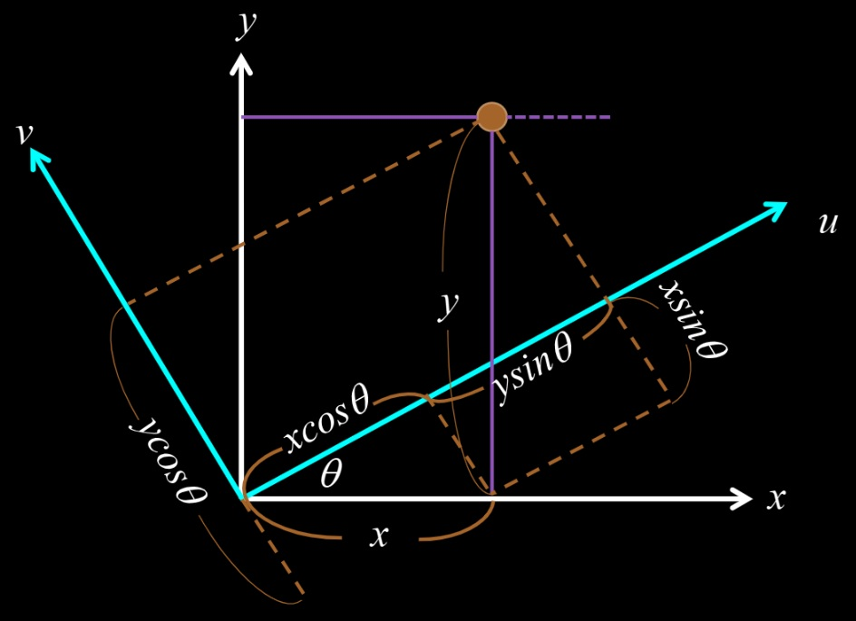
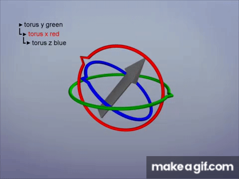

一個物體經過鏡頭投影到屏幕上，會經過多個座標轉換，也就是從物體座標 O(X,Y,Z)，經過相機座標 C(Xc,Yc,Zc)到成像座標 o(x,y)，如果是數位相機還會有個像素座標 g(u,v)，其中成像和像素皆是二維，稱為**內部參數**，其他則是三維，稱為**外部參數**如圖一所示。

## 1. 座標轉換關係
主要在相機座標與成像座標間要有個轉換關係，在此僅考慮進軸近似的成像，也就是透鏡後的像不會扭曲。在此先不考慮旋轉像機後的成像，所以 o -> g 之間僅有伸縮與平移的關係，即

$$\begin{equation}
    \begin{bmatrix}
        u \\
        v \\
        1 \\
    \end{bmatrix}
    =
    \begin{bmatrix}
    M \\
    \end{bmatrix}
    \begin{bmatrix}
        x \\
        y \\
        1 \\
    \end{bmatrix}
    =
    \begin{bmatrix}
        \frac{1}{dx}&0&c \\
        0&\frac{1}{dy}&d \\
        0&0&1 \\
    \end{bmatrix}
    \begin{bmatrix}
        x \\
        y \\
        1 \\
    \end{bmatrix}
\end{equation}$$

寫成三維是等等比較好跟 O -> C 的矩陣計算。O -> C 之間就多了一個維度而已，不過其放大率就跟焦長有關，可以利用相似三角形得到關係如圖二所示

所以矩陣可以寫成

$$\begin{equation}
    \begin{bmatrix}
        X \\
        Y \\
        1 \\
    \end{bmatrix}
    =
    \begin{bmatrix}
    \frac{1}{Z_{C}} \\
    \end{bmatrix}
    \begin{bmatrix}
        f&0&0 \\
        0&f&0 \\
        0&0&1 \\
    \end{bmatrix}
    \begin{bmatrix}
        X_{C} \\
        Y_{C} \\
        Z_{C} \\
    \end{bmatrix}
    +
    \begin{bmatrix}
        X_{0} \\
        Y_{0} \\
        Z_{0} \\
    \end{bmatrix}
\end{equation}$$

當然我們可以把平移像去掉來簡化。最後物體到達成像座標後，與像素座標的關係為

$$\begin{equation}
    \begin{bmatrix}
        u \\
        v \\
        1 \\
    \end{bmatrix}
    =
    \begin{bmatrix}
    M_{1}
    \end{bmatrix}
    \begin{bmatrix}
        x \\
        y \\
        1 \\
    \end{bmatrix}
    =
    \begin{bmatrix}
        \frac{1}{dx}&0&c \\
        0&\frac{1}{dy}&d \\
        0&0&1 \\
    \end{bmatrix}
    \begin{bmatrix}
        x \\
        y \\
        1 \\
    \end{bmatrix}
\end{equation}$$

其中 $\ M_{1} $稱為相機外部參數矩陣。

## 2. 加入旋轉
當相機旋轉時，成像座標會旋轉但物體座標不會，所以兩者又有另一個轉換關係如圖三所示。在此定義旋轉方向為逆時針旋轉。

$$\begin{equation}
    R_{z}\theta_{z} =
    \begin{bmatrix}
        cos\theta&sin\theta&0 \\
        -sin\theta&cos\theta&0 \\
        0&0&1 \\
    \end{bmatrix}
\end{equation}$$

上述即為以 z 軸為旋轉軸的旋轉矩陣，也可以寫下以 x, y 為旋轉軸的矩陣

$$\begin{equation}
    R_{x}\theta_{x} =
    \begin{bmatrix}
        1&0&0 \\
        0&cos\theta&sin\theta \\
        0&-sin\theta&cos\theta \\
    \end{bmatrix}
\end{equation}$$

$$\begin{equation}
    R_{y}\theta_{y} =
    \begin{bmatrix}
        cos\theta&0&sin\theta \\
        0&1&0 \\
        -sin\theta&0&cos\theta \\
    \end{bmatrix}
\end{equation}$$

在此我們就可以寫出當相機與物體有旋轉與平移的矩陣，此即為相機外部矩陣 $\ M_{2} $

$$\begin{equation}
    M_{2} =
    \begin{bmatrix}
        R_{11}&R_{21}&R_{31}&T_{X} \\
        R_{12}&R_{22}&R_{32}&T_{Y} \\
        R_{13}&R_{23}&R_{33}&T_{Z} \\
        0&0&0&1 \\
    \end{bmatrix}
\end{equation}$$

## 3. 三維旋轉矩陣
在古典力學中，我們可以使用歐拉旋轉矩陣 Euler Ratation Matrix 來計算三維空間的旋轉，如圖四所示

而矩陣通常沒有乘法交換率，也就是 $\ M_{1}M_{2} \neq M_{2}M_{1}$，所以如果是要用歐拉旋轉矩陣則必須定義好旋轉順序，也就是一定要先以某個軸為轉軸做旋轉，然後再做下一個，但這樣在計算上就很耗時間，所以通常會採用四元數或是。而另一個問題就是當我們固定某一軸做旋轉，另外兩個旋轉軸就會跟著動，當某個旋轉軸與另一個軸重合時，系統失去一個自由度，導致旋轉表現異常，此稱為萬像鎖 (Gimble lock)

解決此問題有兩種方法，四元數與 Rodrigues 旋轉。電腦視覺中常用四元數(Quaternion)來做旋轉，因為要做連續旋轉或插植很方便。而在電腦圖學中我們僅需做一次旋轉，所以 openCV 中也用此方法。

## 4. 物體座標到像素座標
從前面推導可知其轉換關係為 $\ g = M_{1}M_{2}O $。 $\ M_{1} $為 3x3 矩陣是內部參數， $\ M_{2} $為 4x4 矩陣是外部參數，故至少要有四個方程式才能唯一決定一平面，所以至少要四張圖，而實務上會多拍幾張，並用最小平方法來找出最小誤差的解。

