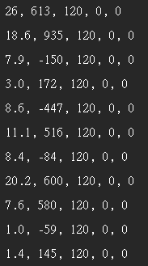
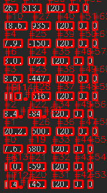
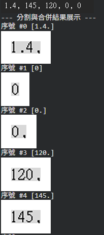
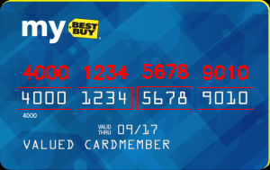

在影像辨識中，數字辨識是一個相對簡單的專案，因為變化少且流程單純，是一個很好學習的專案。

## 一、前處理
前處理通常包含以下步驟
1. 二值化
2. 降噪
3. 找邊
4. 找輪廓
3a. 形態學運算(膨脹/侵蝕)
找完後就可以去把每個數字分割出來。做數字分除了要能找出來，還要能正確地分割數字，例如 101 就要分出 101 而不是 1, 0, 1。
```c++
#include <opencv2/opencv.hpp>
#include <iostream>
using namespace cv;
using namespace std;

int main() {
    // 1. 讀取灰階圖片
    Mat img = imread("digits.png", IMREAD_GRAYSCALE);
    if (img.empty()) {
        cout << "無法讀取圖片" << endl;
        return -1;
    }
    imshow("原始影像", img);
    // 2. 降噪 (Gaussian Blur)
    Mat blurred;
    GaussianBlur(img, blurred, Size(5,5), 0);

    // 3. 使用 Canny 邊緣檢測
    Mat edges;
    Canny(blurred, edges, 50, 150);

    // 4. 使用閉運算 (Closing)
    Mat kernel = getStructuringElement(MORPH_RECT, Size(5,5));
    Mat morphed;
    morphologyEx(edges, morphed, MORPH_CLOSE, kernel, Point(-1,-1), 2);
    imshow("閉運算結果", morphed);

    // 5. 找輪廓
    vector<vector<Point>> contours;
    vector<Vec4i> hierarchy;
    findContours(morphed, contours, hierarchy, RETR_EXTERNAL, CHAIN_APPROX_SIMPLE);

    // 6. 繪製分割結果
    Mat output_canvas;
    cvtColor(img, output_canvas, COLOR_GRAY2BGR);

    cout << "--- 分割與合併結果展示 ---" << endl;
    for (size_t idx = 0, i = 0; idx < contours.size(); idx++, i++;) {
        Rect rect = boundingRect(contours[idx]);
        // 在原圖上畫出紅色框框
        rectangle(output_canvas, rect, Scalar(0,0,255), 2);
        // 寫上序號
        putText(output_canvas, "#" + to_string(i), Point(rect.x, rect.y - 5),
                FONT_HERSHEY_SIMPLEX, 0.5, Scalar(0,0,255), 1);
        // 擷取 ROI
        Mat roi = img(rect);
        cout << "數字區塊 #" << (i+1) << ":" << endl;
        string winName = "ROI " + to_string(i+1);
        imshow(winName, roi);
    }

    cout << "\n整張圖的標記結果:" << endl;
    imshow("分割結果", output_canvas);

    waitKey(0); // 等待按鍵後關閉視窗
    return 0;
}
```



## 二、辨識
一般來說會需要一個已經預訓練好的模型來做辨識，這邊就用 tesseract-ocr 來做
```c++
#include <opencv2/opencv.hpp>
#include <tesseract/baseapi.h>
#include <leptonica/allheaders.h>
#include <iostream>
using namespace cv;
using namespace std;

int main() {
    // 1. 讀取灰階圖片
    Mat img = imread("digits.png", IMREAD_GRAYSCALE);
    if (img.empty()) {
        cout << "無法讀取圖片" << endl;
        return -1;
    }
    imshow("原始影像", img);

    // 2. 降噪 (Gaussian Blur)
    Mat blurred;
    GaussianBlur(img, blurred, Size(5,5), 0);

    // 3. 使用 Canny 邊緣檢測
    Mat edges;
    Canny(blurred, edges, 50, 150);

    // 4. 閉運算 (Closing)
    Mat kernel = getStructuringElement(MORPH_RECT, Size(5,5));
    Mat morphed;
    morphologyEx(edges, morphed, MORPH_CLOSE, kernel, Point(-1,-1), 2);

    // 5. 找輪廓
    vector<vector<Point>> contours;
    vector<Vec4i> hierarchy;
    findContours(morphed, contours, hierarchy, RETR_EXTERNAL, CHAIN_APPROX_SIMPLE);

    // 6. 建立彩色輸出畫布
    Mat output_canvas;
    cvtColor(img, output_canvas, COLOR_GRAY2BGR);

    // 初始化 Tesseract
    tesseract::TessBaseAPI *ocr = new tesseract::TessBaseAPI();
    if (ocr->Init(NULL, "eng")) {
        cout << "Tesseract 初始化失敗" << endl;
        return -1;
    }
    // 設定白名單
    ocr->SetVariable("tessedit_char_whitelist", "0123456789+-.");

    cout << "--- 分割與合併結果展示 ---" << endl;
    int i = 0;
    for (size_t idx = 0; idx < contours.size(); idx++, i++) {
        Rect rect = boundingRect(contours[idx]);
        Mat roi = img(rect);

        // 反轉顏色
        Mat roi_inv;
        bitwise_not(roi, roi_inv);

        // 放大
        Mat roi_resized;
        resize(roi_inv, roi_resized, Size(), 2.0, 2.0, INTER_CUBIC);

        // 補邊框
        Mat roi_padded;
        copyMakeBorder(roi_resized, roi_padded, 20, 20, 20, 20, BORDER_CONSTANT, Scalar(255,255,255));

        // OCR 辨識
        ocr->SetImage(roi_padded.data, roi_padded.cols, roi_padded.rows, 1, roi_padded.step);
        string text = string(ocr->GetUTF8Text());
        // 去除空白與換行
        text.erase(remove(text.begin(), text.end(), '\n'), text.end());
        text.erase(remove(text.begin(), text.end(), '\r'), text.end());

        // 繪製結果
        rectangle(output_canvas, rect, Scalar(0,0,255), 2);
        putText(output_canvas, text, Point(rect.x, rect.y - 10),
                FONT_HERSHEY_SIMPLEX, 0.7, Scalar(0,0,255), 2);

        cout << "序號 #" << i << " [" << text << "]" << endl;
        string winName = "ROI " + to_string(i);
        imshow(winName, roi_padded);
    }

    cout << "\n整張圖的標記結果:" << endl;
    imshow("分割結果", output_canvas);

    waitKey(0);
    ocr->End();
    return 0;
}
```


## 三、辨識卡號
現在很多手機支付可以綁信用卡，而在綁定時可以直接拍照來幫你自動輸入卡號，當然不一定全都能辨識得出來，但多數數字可以，省下了一些時間。
```C++

#include <opencv2/opencv.hpp>
#include <tesseract/baseapi.h>
#include <iostream>
#include <vector>
#include <algorithm>

using namespace cv;
using namespace std;

// 排序輪廓
bool sortByX(const vector<Point>& c1, const vector<Point>& c2) {
    Rect r1 = boundingRect(c1);
    Rect r2 = boundingRect(c2);
    return r1.x < r2.x;
}

Mat resizeImage(const Mat& image, int width = 0, int height = 0) {
    Mat resized;
    if (width == 0 && height == 0) return image.clone();
    Size size;
    if (width == 0) {
        float r = height / (float)image.rows;
        size = Size((int)(image.cols * r), height);
    } else {
        float r = width / (float)image.cols;
        size = Size(width, (int)(image.rows * r));
    }
    resize(image, resized, size, 0, 0, INTER_AREA);
    return resized;
}

int main() {
    // 讀取影像
    Mat image = imread("creditcard.png");
    if (image.empty()) {
        cout << "Image not found!" << endl;
        return -1;
    }

    Mat ref;
    cvtColor(image, ref, COLOR_BGR2GRAY);
    threshold(ref, ref, 10, 255, THRESH_BINARY_INV);

    vector<vector<Point>> refCnts;
    findContours(ref.clone(), refCnts, RETR_EXTERNAL, CHAIN_APPROX_SIMPLE);
    sort(refCnts.begin(), refCnts.end(), sortByX);

    // 儲存數字模板
    vector<Mat> digits;
    for (size_t i = 0; i < refCnts.size(); ++i) {
        Rect roi = boundingRect(refCnts[i]);
        Mat digit = ref(roi);
        resize(digit, digit, Size(57, 88));
        digits.push_back(digit);
    }

    // 影像預處理
    Mat gray = resizeImage(image, 300);
    cvtColor(gray, gray, COLOR_BGR2GRAY);

    Mat rectKernel = getStructuringElement(MORPH_RECT, Size(9, 3));
    Mat sqKernel = getStructuringElement(MORPH_RECT, Size(5, 5));
    Mat tophat;
    morphologyEx(gray, tophat, MORPH_TOPHAT, rectKernel);

    Mat blurred;
    GaussianBlur(tophat, blurred, Size(5, 5), 0);

    Mat edged;
    Canny(blurred, edged, 10, 150);

    Mat gradX;
    morphologyEx(edged, gradX, MORPH_CLOSE, rectKernel);

    Mat thresh;
    threshold(gradX, thresh, 0, 255, THRESH_BINARY | THRESH_OTSU);

    morphologyEx(thresh, thresh, MORPH_CLOSE, sqKernel);

    vector<vector<Point>> cnts;
    findContours(thresh.clone(), cnts, RETR_EXTERNAL, CHAIN_APPROX_SIMPLE);

    vector<Rect> locs;
    for (const auto& c : cnts) {
        Rect r = boundingRect(c);
        float ar = r.width / (float)r.height;
        if (ar > 2.5 && ar < 4.0 && r.width > 40 && r.width < 55 && r.height > 10 && r.height < 20) {
            locs.push_back(r);
        }
    }
    sort(locs.begin(), locs.end(), const Rect& a, const Rect& b { return a.x < b.x; });

    tesseract::TessBaseAPI tess;
    tess.Init(NULL, "eng", tesseract::OEM_LSTM_ONLY);
    tess.SetVariable("tessedit_char_whitelist", "0123456789");
    tess.SetPageSegMode(tesseract::PSM_SINGLE_LINE);

    vector<string> output;
    for (size_t i = 0; i < locs.size(); ++i) {
        Rect r = locs[i];
        Mat group = gray(Rect(max(0, r.y - 10), max(0, r.x - 10), min(gray.cols - r.x, r.width + 20), min(gray.rows - r.y, r.height + 20)));
        resize(group, group, Size(), 3, 3, INTER_CUBIC);
        threshold(group, group, 0, 255, THRESH_BINARY | THRESH_OTSU);

        if (mean(group)[0] < 127) {
            bitwise_not(group, group);
        }
        Mat kernel = Mat::ones(2, 2, CV_8U);
        erode(group, group, kernel);

        imshow("Group " + to_string(i + 1), group);
        waitKey(0);

        tess.SetImage(group.data, group.cols, group.rows, 1, group.step);
        string text = tess.GetUTF8Text();
        text.erase(remove_if(text.begin(), text.end(), ::isspace), text.end());

        rectangle(image, Point(r.x - 5, r.y - 5), Point(r.x + r.width + 5, r.y + r.height + 5), Scalar(0, 0, 255), 1);
        putText(image, text, Point(r.x, r.y - 15), FONT_HERSHEY_SIMPLEX, 0.65, Scalar(0, 0, 255), 2);

        output.push_back(text);
    }

    cout << "\n最終辨識結果: ";
    for (size_t i = 0; i < output.size(); ++i) {
        cout << output[i];
        if (i != output.size() - 1) cout << "-";
    }
    cout << endl;

    imshow("Result", image);
    waitKey(0);

    return 0;
}
```

